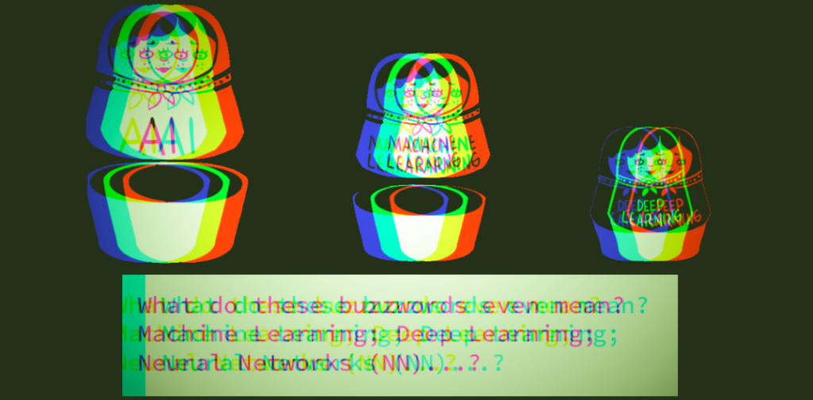

## Willkommen auf der Workshop Website

Hier findest du die Materialien für den Workshop _How to Build an Artificial Coder - Machine Learning für die Automatisierte Inhaltsanalyse"_. 


### Download Workshop-Ordner 

Klicke [hier](https://github.com/ankekat1000/Workshop-ML-Automatisierte-Inhaltsanalyse/archive/main.zip), um den Workshop-Ordner als .zip-Datei von GitHub herunterzuladen. Im Workshop-Ordner findest du alle **Skripte, Folien und Datensätze**, die wir im Workshop benutzen. Oder du kannst dir auf [GitHub](https://github.com/ankekat1000/Workshop-ML-Automatisierte-Inhaltsanalyse) das Material ansehen. 

### Getting Started - Material zur Vorbereitung

Du brauchst für den Workshop keine Vorkenntnisse. Aber du benötigst Python mit allem drum und dran:

1. **Python mit Anaconda installieren**: Gehe auf die [Homepage von Anaconda](https://www.anaconda.com/products/individual) und lade dir die Software für dein Betriebssystem herunter. Anaconda benutzen wir, damit wir unter Windows und MacOX einfacher programmieren können. Mit Anaconda erhälts du Python, viele vorinstallierte Python-Packages und Programmiersoftware, wie z.B. Jupyter Notebook. In diesem [Tutorial](https://www.youtube.com/watch?v=5mDYijMfSzs "Watch this first tutorial") kannst du dir ansehen, wie du Anaconda unter Windows installierst (bis min 05:07).

[](http://www.youtube.com/watch?v=5mDYijMfSzs "Watch this first tutorial")

2. **Python-Packages installieren**: Folge dem Tutorial weiter (min 05:08 - 06:41) um zu lernen, wie man Python-Packages installiert. (Dies ist nur eine von mehreren Möglichkeiten.) Versuche die folgenden Packages zu installieren:

```
conda install pandas
conda install re
conda install numpy
conda install scikit-learn
conda install nltk

```


### Workshop-Agenda

### Weiterführende Tutorials

1. deep


```markdown
Syntax highlighted code block

# Header 1
## Header 2
### Header 3

- Bulleted
- List

1. Numbered
2. List

**Bold** and _Italic_ and `Code` text

[Link](url) and 
```

For more details see [GitHub Flavored Markdown](https://guides.github.com/features/mastering-markdown/).

### Jekyll Themes

Your Pages site will use the layout and styles from the Jekyll theme you have selected in your [repository settings](https://github.com/ankekat1000/Workshop-ML-AutomatisierteInhaltsanalyse/settings). The name of this theme is saved in the Jekyll `_config.yml` configuration file.

### Noch mehr Methoden-Workshops!

Having trouble with Pages? Check out our [documentation](https://docs.github.com/categories/github-pages-basics/) or [contact support](https://support.github.com/contact) and we’ll help you sort it out.
